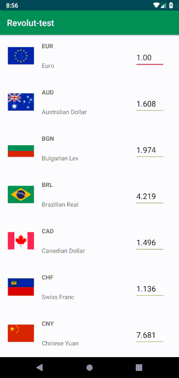

# RevolutTestProject

Hello! This a test project for revolut.

This app is build following a MVVM approach and using Android LiveData bindings.

For your convenience, last build's APK is uploaded in the Android CI Workflow. Please click on the badge above to access it.

Thanks for giving me the opportunity to build this, it's been a pleasure. Completed in 4 days (11/04/20 - 14/04/20)

Video:

Note: in order to be production ready this project should also have an InstrumentedTest that covers user behavior on the main screen. I'm leaving this part out due to time constraint.
